# Proof Of Concept Praktikum Jaringan Komputer Modul 1

- [Proof Of Concept Praktikum Jaringan Komputer Modul 1](#proof-of-concept-praktikum-jaringan-komputer-modul-1)
  - [Kelompok : B13](#kelompok--b13)
  - [Soal 1](#soal-1)
    - [Deskripsi](#deskripsi)
    - [Solusi](#solusi)
    - [Hasil :](#hasil-)
  - [Soal No 2](#soal-no-2)
    - [Deskripsi](#deskripsi-1)
    - [Solusi](#solusi-1)
    - [Hasil](#hasil)
  - [Soal No 3](#soal-no-3)
    - [Deskripsi](#deskripsi-2)
    - [Solusi](#solusi-2)
    - [Hasil](#hasil-1)
  - [Soal No 4](#soal-no-4)
    - [Deskripsi](#deskripsi-3)
    - [Solusi](#solusi-3)
    - [Hasil](#hasil-2)
  - [Soal No 5](#soal-no-5)
    - [Deskripsi](#deskripsi-4)
    - [Solusi](#solusi-4)
  - [Soal No 6](#soal-no-6)
    - [Deskripsi :](#deskripsi-)
    - [Solusi](#solusi-5)
    - [Hasil](#hasil-3)
  - [Soal No 7](#soal-no-7)
    - [Deskripsi](#deskripsi-5)
    - [Solusi](#solusi-6)
    - [Hasil](#hasil-4)
  - [Soal No 8](#soal-no-8)
    - [Deskripsi](#deskripsi-6)
    - [Solusi](#solusi-7)
    - [Hasil](#hasil-5)
  - [Soal No 9](#soal-no-9)
    - [Deskripsi](#deskripsi-7)
    - [Solusi](#solusi-8)
  - [Soal No 10](#soal-no-10)
    - [Deskripsi](#deskripsi-8)
    - [Solusi](#solusi-9)
    - [Hasil](#hasil-6)

## Kelompok : B13

| NRP        | Nama                 |
| ---------- | -------------------- |
| 5025211042 | Robby Ulung Pambudi  |
| 5025211151 | Tsaqif Deniar Bhakti |

## Soal 1

### Deskripsi

User melakukan berbagai aktivitas dengan menggunakan protokol FTP. Salah satunya adalah mengunggah suatu file.

- Berapakah sequence number (raw) pada packet yang menunjukkan aktivitas tersebut?
- Berapakah acknowledge number (raw) pada packet yang menunjukkan aktivitas tersebut?
- Berapakah sequence number (raw) pada packet yang menunjukkan response dari aktivitas tersebut?
- Berapakah acknowledge number (raw) pada packet yang menunjukkan response dari aktivitas tersebut?

### Solusi

Untuk Melihat aktivitas menggunakan protokol FTP pada wireshark maka kita perlu menggunakan sebuah filter, syntax untuk melakukan filter tersebut adalah :

```
ftp
```

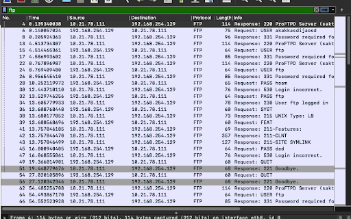

Untuk mencaritau aktivitas user yang dimana aktivitas tersebut adalah sebuah upload suatu dokumen maka kita bisa menggunakan perintah filter sebagai berikut :

```
ftp.request.command == "STOR"
```

Diapatkan sebuah hasil sebagai berikut :

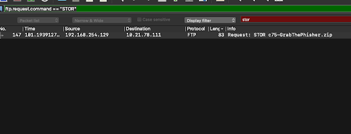
Untuk mencari respond dari ftp tersebut maka bisa kita gunakan perintah sebagai berikut :

```
ftp.response.arg contains "c75"
```

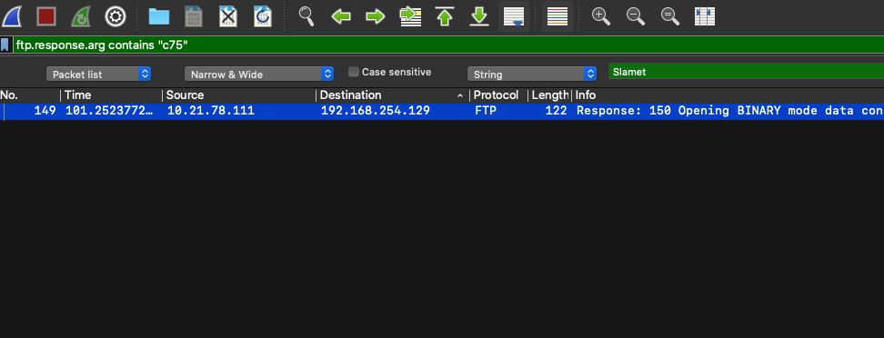

Ketika kita lihat lebih detail isi dari packet tersebut maka kita akan mendapatkan jawaban dari soal Point 2, 3 dan 4

**Hasil Request**
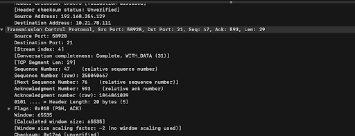
**Hasil Response**
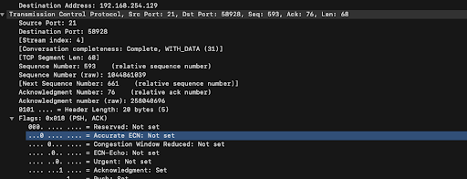

### Hasil :

- Sequence number (RAW) pada paket yang menunjukan aktivitas tersebut adalah : **258040667**
- acknowledge number pada paket yang menunjukan aktivitas tersebut adalah : **1044861039**
- Sequence number (RAW) pada paket yang menunjukan response aktivitas tersebut adalah : **1044861039**
- acknowledge number pada paket yang menunjukan response aktivitas tersebut adalah : **258040696**

## Soal No 2

### Deskripsi
Sebutkan web server yang digunakan pada portal praktikum Jaringan Komputer!

### Solusi
- Search terlebih dahulu ip yang digunakan pada portal praktikum jarkom yaitu "10.21.78.111"
- Setelah itu klik kanan pada paket yang dituju dan klik follow
- lalu klik http stream
- setelah itu akan terlihat server name yaitu “gunicorn”

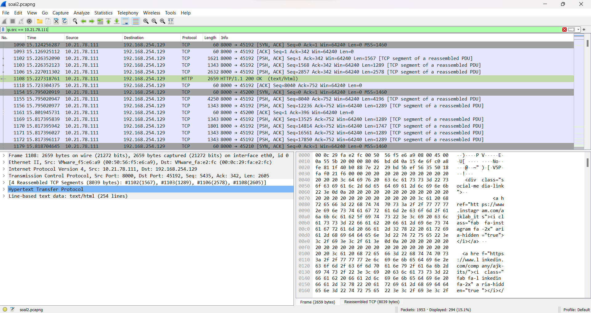

**Tampilan Http Stream** :

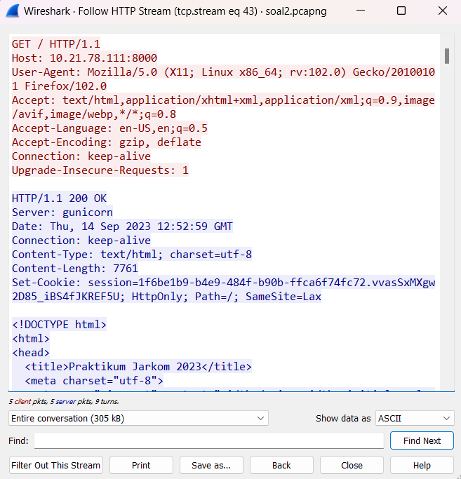

### Hasil
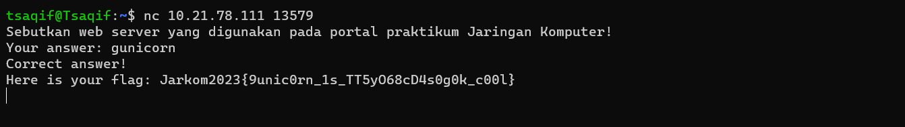

Web server yang digunakan pada portal praktikum jarkom yaitu "gunicorn"

## Soal No 3

### Deskripsi

Dapin sedang belajar analisis jaringan. Bantulah Dapin untuk mengerjakan soal berikut:

- Berapa banyak paket yang tercapture dengan IP source maupun destination address adalah 239.255.255.250 dengan port 3702?
- Protokol layer transport apa yang digunakan?

### Solusi

Untuk melakukan capture dengan soruce dan destination ke ip tertentu kita bisa menggunakan sebuah syntax sebagai berikut :

```
(ip.src == 239.255.255.250 || ip.dst == 239.255.255.250) && udp.port == 3702
```

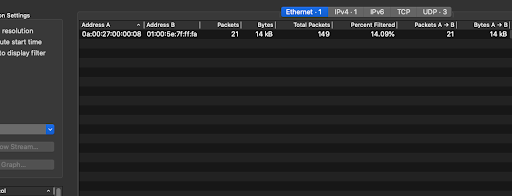

### Hasil

- Banyak paket adalah : **21**
- Protokol layer transport yang digunakan adalah : **UDP**

## Soal No 4

### Deskripsi

Berapa nilai checksum yang didapat dari header pada paket nomor 130?

### Solusi

Lihat package no 130
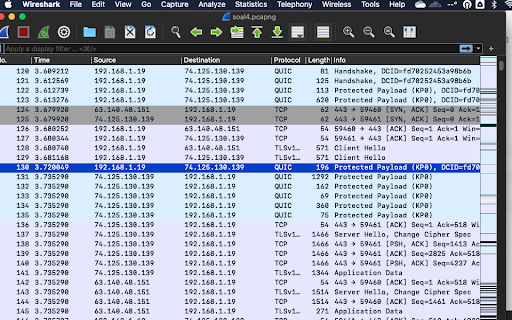

Kemudian Klik 2 kali di No 130 Tersebut sampai muncul tampilan sebagai berikut :

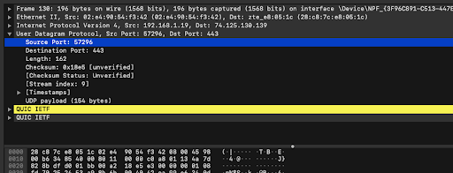

### Hasil

Didapatkan checksumnya adalah : **0x18e5**

## Soal No 5

### Deskripsi

- Berapa banyak packet yang berhasil di capture dari file pcap tersebut?
- Port berapakah pada server yang digunakan untuk service SMTP?
- Dari semua alamat IP yang tercapture, IP berapakah yang merupakan public IP?

### Solusi

Untuk melihat stastik dari sebuah file pcap maka kita bisa pergi ke statistik -> conversations

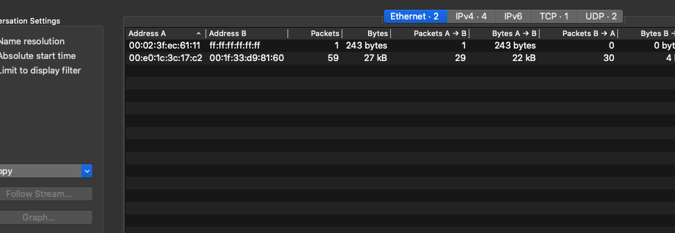

Untuk mecari port SMTP defaultnya adalah 25, atau kita bisa menggunakan syntax sebagai berikut :

```
smtp
```

Dan bisa kita lihat hasilnya di salah satu packetnya

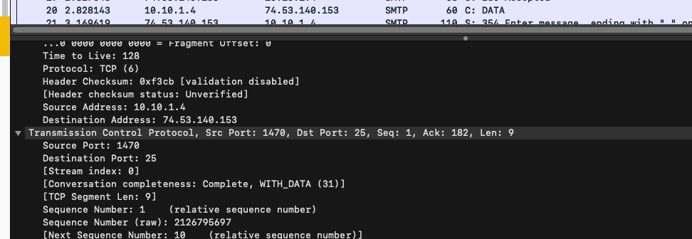

Ynag merupakan ip public adalah : **74.53.140.153**

Karena terletak di range IP Public

**HASIL**

- Banyak packet yang berhasil di capture adalah : **60**
- PORT SMTP : 25
- IP Public : **74.53.140.153**

## Soal No 6

### Deskripsi :

Seorang anak bernama Udin Berteman dengan SlameT yang merupakan seorang penggemar film detektif. sebagai teman yang baik, Ia selalu mengajak slamet untuk bermain valoranT bersama. suatu malam, terjadi sebuah hal yang tak terdUga. ketika udin mereka membuka game tersebut, laptop udin menunjukkan sebuah field text dan Sebuah kode Invalid bertuliskan "server SOURCE ADDRESS 7812 is invalid". ketika ditelusuri di google, hasil pencarian hanya menampilkan a1 e5 u21. jiwa detektif slamet pun bergejolak. bantulah udin dan slamet untuk menemukan solusi kode error tersebut.

### Solusi

### Hasil

## Soal No 7

### Deskripsi

### Solusi

### Hasil

## Soal No 8

### Deskripsi

Berikan kueri filter sehingga wireshark hanya mengambil semua protokol paket yang menuju port 80! (Jika terdapat lebih dari 1 port, maka urutkan sesuai dengan abjad)

### Solusi

Untuk mengambil semua paket yang menuju ke port 80 kita bisa gunakan sebuah syntax sebagai berikut :

```
tcp.dstport == 80 || udp.dstport == 80

```

Kemudian kita lihat stastiknya dengan cara pergi ke menu statistik -> conversations

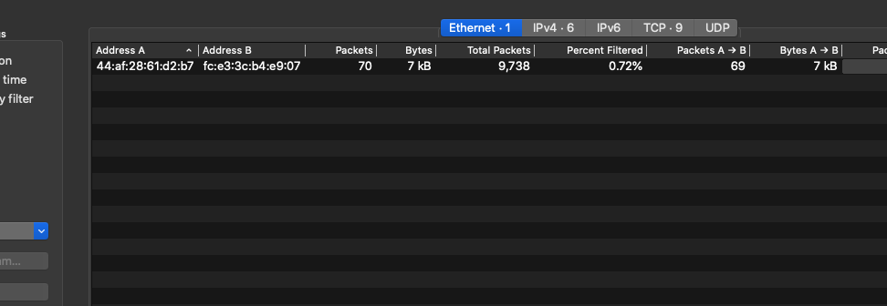

### Hasil

Didapatkan jumlah paket yang menuju ke port 80 adalah : **70**

## Soal No 9

### Deskripsi

### Solusi

## Soal No 10

### Deskripsi

Sebutkan kredensial yang benar ketika user mencoba login menggunakan Telnet!

### Solusi

- Filter telnet
- kemudian cari username dan password dari wireshark
- kemudian dicoba satu per satu

### Hasil

Password yang benar adalah :
**dhafin:kesayangannyak0k0**
